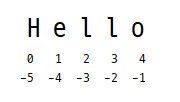

layout: true
.top-line[]

---
class: center, middle
# Python - Basic

허준영(jyheo@hansung.ac.kr)

---
## Contents
* Strings
* If Statement
* Function
* While Loop
* List
* Tuple
* Dict
* Set
* File
* Pickle
* Exercise

---
## Strings

* Built-in class "str"
* String literals: "str" or 'str'

```python
>>> s='hello'
>>> type(s)
<class 'str'>
>>> s2="hello"
>>> type(s2)
<class 'str'>
```

---
## Strings
### String Manipulation
* String is a list of characters
```python
>>> s='hello'
>>> print(s[0], s[1], s[-1], s[-2], len(s))
h e o l 5
>>> print(s + 'world')
helloworld
```
* String is immutable
```python
>>> s[1]='b'
Traceback (most recent call last):
  File "<stdin>", line 1, in <module>
TypeError: 'str' object does not support item assignment
```



---
## Strings
### str()
* str + int
```python
>>> num=10
>>> print(s + num)
Traceback (most recent call last):
  File "<stdin>", line 1, in <module>
TypeError: Can't convert 'int' object to str implicitly
>>> print(s + str(num))
hello10
```

---
## Strings
### String Methods
* str.lower(), str.upper()
* str.strip()
* str.isalpha(), str.isdigit(), str.isspace()
* str.startswith('other'), str.endswith('other')
* str.find('other')
* str.replace('old', 'new')
* str.split('delim')
* s.join(list)

```python
>>> 'a,b,c'.split(',')
['a', 'b', 'c']
>>> ':'.join(['a', 'b', 'c'])
'a:b:c'
```

---
## Strings
### String Slice
* Substring of a String
* str[start_index:end_index]
    - from the characters at start_index but excluding end_index


```python
>>> s = 'Hello'
>>> s[1:3]
'el'
>>> s[:3]
'Hel'
>>> s[1:]
'ello'
>>> s[:-1]
'Hell'
>>> s[:-2]
'Hel'
>>> s[-4:3]
'el'
```

---
## Strings
### Format String (OLD)
* str % (tuple of arguments)

```python
>>> str = 'Hello %s, %d' % ('World', 10)
>>> print(str)
Hello World, 10
```

---
## Strings
### Format String (NEW)
* str.format()

```python
>>> str = 'Hello {}, {}'.format('World', 10)
>>> str
'Hello World, 10'
>>> str = 'Hello {wd}, {num}'.format(num=10, wd='World')
>>> str
'Hello World, 10'
>>> str = 'Hello {wd:10}, {num:.3f}'.format(num=10.0, wd='World')
>>> str
'Hello World     , 10.000'
```

---
## Strings
### Format String (NEW 3.6+)
* Formatted string literals

```python
>>> w = 'World'
>>> num = 10
>>> f'Hello {w}, {num}'
'Hello World, 10'
>>> f'Hello {w}, {num + num}'
'Hello World, 20'
```

---
## If Statement
* if CONDITION: STATEMENT(or BLOCK)
* elif CONDITION: STATEMENT(or BLOCK)
* else: STATEMENT(or BLOCK)

```python
>>> num = 10
>>> if num > 5:
...     print('num is greater than 5')
...
num is greater than 5
>>> if num > 5:
...     print('num is greater than 5')
... elif num == 5:
...     print('num is 5')
... else:
...     print('num is smaller than 5')
...
num is greater than 5
```

---
## Function
### Function Calls

```python
>>> type(32)
<class 'int'>
>>> int('32')
32
>>> int('Hello')
Traceback (most recent call last):
  File "<stdin>", line 1, in <module>
ValueError: invalid literal for int() with base 10: 'Hello'
>>> int(-2.3)
-2
>>> str(3.141592)
'3.141592'
```

* Math Functions
```python
>>> import math
>>> math.log10(20)
1.3010299956639813
>>> math.sin(0.7)
0.644217687237691
>>> math.sqrt(2)
1.4142135623730951
>>> help('math')
```

---
## Function
### Adding New Functions
* def function_name(parameters): BLOCK

```python
>>> def print_name():
...     print("I'm Junyoung.")
...     print("I'm Mr. Heo.")
...
>>> print(print_name)
<function print_name at 0x7f8dafbcac80>
>>> type(print_name)
<class 'function'>
>>> print_name()
I'm Junyoung.
I'm Mr. Heo.
```

---
## Function
### Function parameters and arguments
```python
>>> def print_twice(arg1):
...     print(arg1)
...     print(arg1)
...
>>> print_twice(math.pi)
3.141592653589793
3.141592653589793
>>> print_twice('Spam' * 4)
SpamSpamSpamSpam
SpamSpamSpamSpam
```

* arg1 is a parameter, and the value of arg1 is an argument
* Variables and parameters in a function are local

---
## Function
### Function Returns
* return
```python
>>> result = print_twice('Bing')
Bing
Bing
>>> print(result)
*None
>>> def print_twice(arg1):
...     print(arg1)
...     print(arg1)
*...     return arg1*2
...
>>> result = print_twice('Bing')
Bing
Bing
>>> print(result)
BingBing
```

---
## Function
### Importing with 'from'
* import MODULE
```python
>>> import math
>>> print(math)
<module 'math' (built-in)>
>>> print(math.pi)
3.141592653589793
>>> print(pi)
Traceback (most recent call last):
  File "<stdin>", line 1, in <module>
NameError: name 'pi' is not defined
```
* from MODULE import SOMETHING
```python
>>> from math import pi
>>> print(pi)
3.141592653589793
>>> from math import *
>>> cos(pi)
-1.0
```

---
## Function
### Checking type of arguments

```python
def factorial (n):
*   if not isinstance(n, int):
        print('Factorial is only defined for integers.')
        return None
    elif n < 0:
        print('Factorial is not defined for negative integers.')
        return None
    elif n == 0:
        return 1
    else:
        return n * factorial(n-1)
```

* isinstance
* Recursive calls

---
## While Loop
* while CONDITION: STATEMENT(or BLOCK)
```python
    def countdown(n):
        while n > 0:
            print(n)
            n = n-1
```

* break, continue
```python
>>> s = 0
>>> while True:
...     s += 1
...     if s > 5: break
...     if s < 3: continue
...     print(s)
...
3
4
5
```

---
## List
* built-in list
* List literals written in [ ]
* List is similar to String
* Any object can be an item of the List

```python
>>> strs = ['a', 'b', 'c', 'd']
>>> strs[0]
'a'
>>> strs[-1]
'd'
>>> len(strs)
4
>>> 'a' in strs
True
>>> strs[0:2]
['a', 'b']
>>> strs + ['e', 'f']
['a', 'b', 'c', 'd', 'e', 'f']
>>> clist = [1, 'a', 'd', 4]
```

---
## List
### Pointer to list

```python
>>> pstrs = strs
>>> pstrs
['a', 'b', 'c', 'd']
>>> id(strs)
140642819912328
>>> id(pstrs)
140642819912328
>>> nstrs = ['a', 'b', 'c', 'd']
>>> id(nstrs)
140642819048136
```

* id(object) returns the address of the object

---
## List
### Iteration
* for X in LIST: BLOCK
```python
>>> strs = ['a', 'b', 'c', 'd']
>>> for x in strs:
...     print(x)
...
a
b
c
d
```

---
## List
### FOR with range()

* range() returns Iterator, which used in FOR Loop
```python
>>> for i in range(3): print(i)
...
0
1
2
>>> for i in range(1, 4): print(i)
...
1
2
3
>>> for i in range(1, 6, 2): print(i)
...
1
3
5
>>> for i in range(2, -1, -1): print(i)
...
2
1
0
>>>
```

---
## List
### List Methods
* list.append(elem)
* list.insert(index, elem)
* list.extend(list2)
* list.index(elem) : searches for the given element
* list.remove(elem)
* list.sort() : sorts the list in place (The sorted() is preferred.)
* list.reverse()
* list.pop(index) : the opposite of append() and insert()

---
## List
### List Methods

```python
>>> strs = []
>>> strs.append('a')
>>> strs
['a']
>>> strs.extend(['b', 'c', 'd'])
>>> strs
['a', 'b', 'c', 'd']
>>> strs.insert(1, 'a2')
>>> strs
['a', 'a2', 'b', 'c', 'd']
>>> strs.index('b')
2
>>> strs.remove('b')
>>> strs
['a', 'a2', 'c', 'd']
>>> strs.pop()
'd'
>>> strs
['a', 'a2', 'c']
>>> strs.reverse()
>>> strs
['c', 'a2', 'a']
>>> strs.sort()
>>> strs
['a', 'a2', 'c']
```

---
## List
### sorted()
* returns a new sorted list
```python
>>> strs = ['ab', 'ef', 'az']
>>> sorted(strs)
['ab', 'az', 'ef']
>>> strs
['ab', 'ef', 'az']
>>> sorted(strs, reverse=True)
['ef', 'az', 'ab']
>>> sorted(strs, key=(lambda s: s[-1]))
['ab', 'ef', 'az']
```

* lambda: anonymous function
```python
>>> (lambda x, y: x + y)(1, 5)
6
```

---
## List
### List Comprehensions
* Compact and nice way to generate a new list based on a list
* [ EXPRESSION for X in LIST if CONDITION]

```python
>>> nums = [1, 2, 3, 4]
>>> [ 2*x for x in nums]
[2, 4, 6, 8]
>>> [ 2*x for x in nums if x % 2 == 0]
[4, 8]
>>> strs = ['hello', 'Hello', 'hEllo']
>>> [ s.lower() for s in strs]
['hello', 'hello', 'hello']
```

---
## Tuple
* Fixed size of list
* Tuple literals written in ( )
* Tuple can be used for multiple return values

```python
>>> tp = (1, 2, 3)
>>> tp
(1, 2, 3)
>>> tp[0] = 3
Traceback (most recent call last):
  File "<stdin>", line 1, in <module>
TypeError: 'tuple' object does not support item assignment
>>> def multi_returns(): return (1, 2)
...
>>> (ra, rb) = multi_returns()
>>> ra
1
>>> rb
2
```

---
## Dict
* key/value hash table
* Dict literals wrtten in { }
* key must be an immutable object
* value can be any object

```python
>>> d = {'a':1, 'b':2, 'c':3}
>>> d
{'a': 1, 'c': 3, 'b': 2}
>>> d['b']
2
>>> d['c']
3
```

---
## Dict
* Add new key/value
* KeyError
* Delete

```python
>>> d['z']=10       # add new key/value
>>> d
{'a': 1, 'c': 3, 'z': 10, 'b': 2}
>>> d['f']
Traceback (most recent call last):
  File "<stdin>", line 1, in <module>
KeyError: 'f'
>>> if 'f' in d: print(d['f'])
...
>>> try:
...     d['f']
... except KeyError:
...     pass
...
>>> del d['z']     # Delete, del can be used in List
>>> d
{'a': 1, 'c': 3, 'b': 2}
```

---
## Dict
### Iteration
* dict.keys() returns list of keys
* dict.values() returns list of values
* dict.items() returns list of (k,v)

```python
>>> d
{'a': 1, 'c': 3, 'b': 2}
>>> for key in d: print(key)
...
a
c
b
>>> for value in d.values(): print(value)
...
1
3
2
>>> for k, v in d.items(): print(k, v)
...
a 1
c 3
b 2
```

---
## Dict
### Format String
* Format String % Dict

```python
>>> args = {'name':'jy', 'age':40}
>>> 'I am %(name)s and %(age)d.' % args
'I am jy and 40.'
```

---
## Set
* Manipulating unordered collections of unique elements
* Set operations: membership testing, add/remove a element, intersection, union, difference, and symmetric difference
* The set classes are implemented using dictionaries

```python
>>> s1 = {1, 2, 3, 3, 5}    # set creation
>>> s1
{1, 2, 3, 5}
>>> list1 = ['a', 'b', 'c', 'c']
>>> list1
['a', 'b', 'c', 'c']
>>> set(list1)              # list to set
{'c', 'b', 'a'}
>>> s1.add(4)               # add an element
>>> s1
{1, 2, 3, 4, 5}
>>> s1.update({7, 8, 9})    # add some elements
>>> s1
{1, 2, 3, 4, 5, 7, 8, 9}
>>> s1.remove(5)            # remove a element
```

---
## Set

```python
>>> s1
{1, 2, 3, 4, 7, 8, 9}
>>> s2 = {2, 3, 4, 10, 11}
>>> s1 & s2         # s1.intersection(s2)
{2, 3, 4}
>>> s1 | s2         # s1.union(s2) 
{1, 2, 3, 4, 7, 8, 9, 10, 11}
>>> s1 - s2         # s1.difference(s2)
{8, 1, 9, 7}
>>> s2
{3, 2, 10, 11, 4}
>>> s3 = {3, 2, 10, 11, 4, 5}
>>> s3.issuperset(s2)
True
>>> s2.issubset(s3)
True
>>> 5 in s3
True
>>> 5 in s2
False
>>> 5 not in s2
True
```

---
## File
* open() returns a file object
    - open(filename, mode)
    - mode: 'r', 'w', 'a', 'b'

```python
>>> f = open('workfile', 'w')
>>> f.write('data to be written')
18
>>> f.close()
```

* with open(filename, mode) as f

```python
>>> with open('workfile', 'r') as f:
...     read_data = f.read()
...
>>> read_data
'data to be written'
>>> f.closed
True
```

---
## Pickle
* Serializing and de-serializing a Python object structure
    - Pickling: A Python object hierarchy is converted into a byte stream
    - Unpickling: Inverse operation, a byte stream (from a binary file or bytes-like object) is converted back into an object hierarchy.
* **Never unpickle data received from an untrusted source**

```python
>>> import pickle
>>> data = {
...     'a': [1, 2.0, 3, 4+6j],
...     'b': ("character string", b"byte string"),
...     'c': {None, True, False}
... }
>>> with open('data.pickle', 'wb') as f:
...     pickle.dump(data, f)
...
>>> with open('data.pickle', 'rb') as f:
...     data2 = pickle.load(f)
...
>>> print(data2)
{'b': ('character string', b'byte string'), 'a': [1, 2.0, 3, (4+6j)], 'c': {False, True, None}}
```

---
## Exercise
* Write a program to count lines, words and characters of a file.
* Hint: how to read a file
    ```python
    # read a file line by line
    f = open('test.txt')
    for l in f.readlines():
        print(l)
    f.close()
    ```
    ```python
    with open('test.txt') as f:
        for l in f.readlines():
            print(l)
    ```

---
## Exercise2
* Write a program to count occurrences of each word in a text file.
* Hint: split(), strip(), dict()