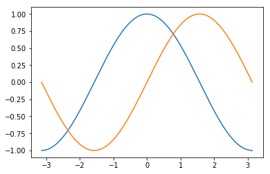
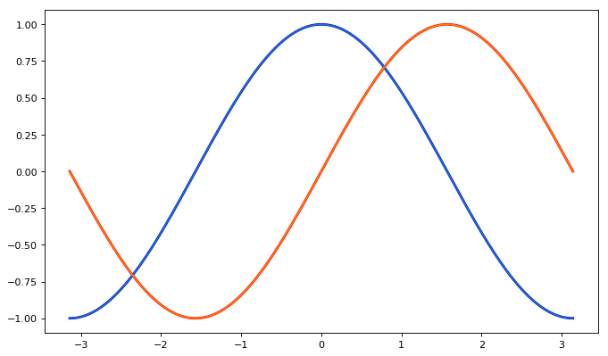
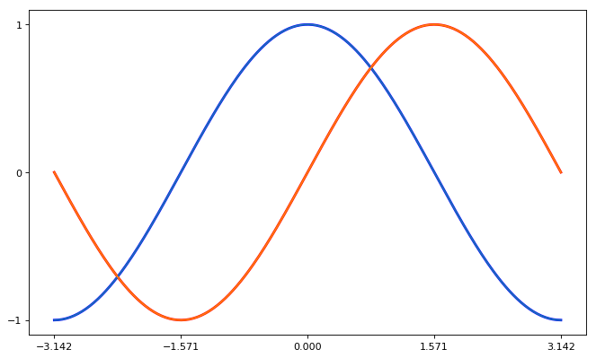
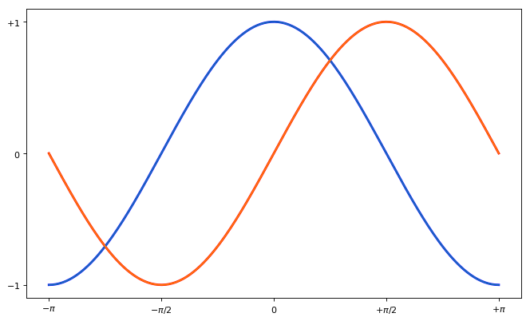
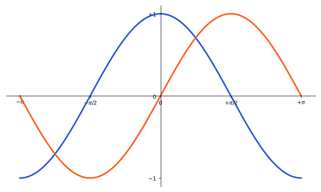
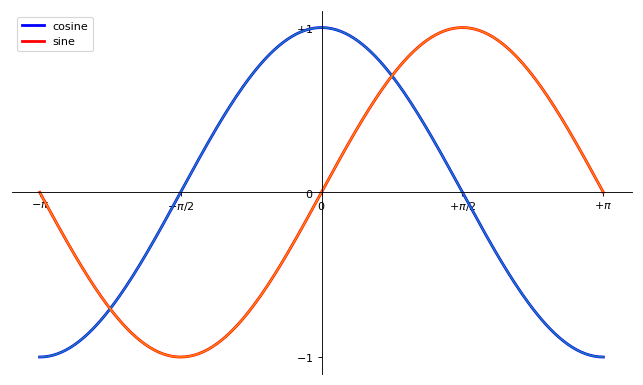
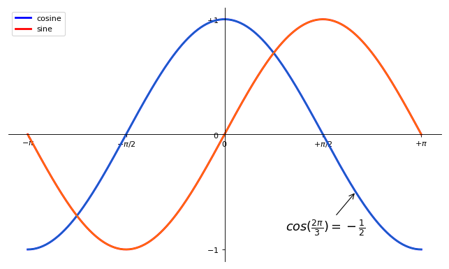
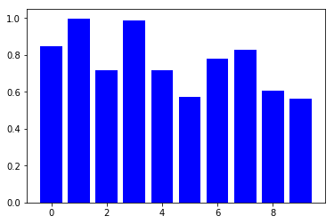
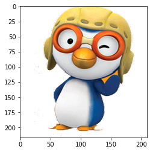

layout: true
.top-line[]

---
class: center, middle
# Python - Matplotlib

허준영(jyheo@hansung.ac.kr)

---
## Contents
* Matplotlib
* Simple Plot
* Default Settings
* Customizing Plot
* Legend
* Annotation
* Scatter Plot
* Bar Plot
* Image Plot
* References
* Exercise

---
## Matplotlib
* 2D plotting library which produces publication quality figures
* with just a few lines of code
    - plots, histograms, power spectra, bar charts, errorcharts, scatterplots, etc.
    - http://matplotlib.org/gallery.html
* Import
```python
from matplotlib import pyplot as plt
import numpy as np
```


* IPyton is highly recommended for matplotlib

---
## Simple Plot
* Properties of a Plot
    - figure size and dpi, line width, color and style, axes, axis and grid properties, text and font properties and so on.
    - If not set, default settings used

.left-column-50[
```python
import numpy as np
import matplotlib.pyplot as plt

X = np.linspace(-np.pi, np.pi, 256, endpoint=True)
C, S = np.cos(X), np.sin(X)

plt.plot(X, C)
plt.plot(X, S)

plt.show()
```
]
.right-column-50[

]

---
## Default Settings
```python
import numpy as np
import matplotlib.pyplot as plt

plt.figure(figsize=(8, 6), dpi=80) # Create a figure of size 8x6 inches, 80 dots per inch

plt.subplot(1, 1, 1) # Create a new subplot from a grid of 1x1

X = np.linspace(-np.pi, np.pi, 256, endpoint=True)
C, S = np.cos(X), np.sin(X)

plt.plot(X, C, color="blue", linewidth=1.0, linestyle="-") # Plot with a blue continuous line of width 1 (pixels)

plt.plot(X, S, color="green", linewidth=1.0, linestyle="-") # Plot with a green continuous line of width 1 (pixels)

plt.xlim(-4.0, 4.0) # Set x limits

plt.xticks(np.linspace(-4, 4, 9, endpoint=True)) # Set x ticks

plt.ylim(-1.0, 1.0) # Set y limits

plt.yticks(np.linspace(-1, 1, 5, endpoint=True)) # Set y ticks

plt.show() # Show result on screen
```

---
## Customizing Plot
### Figure Size, Colors and Line Widths
* Cosine in blue, Sine in red, thicker line, Figure size 10x6 inches
```python
plt.figure(figsize=(10, 6), dpi=80)
plt.plot(X, C, color="blue", linewidth=2.5, linestyle="-")
plt.plot(X, S, color="red",  linewidth=2.5, linestyle="-")
```


---
## Customizing Plot
### Limits and ticks
* plt.xlim(lower, upper), plt.xticks(array)
```python
plt.xlim(X.min() * 1.1, X.max() * 1.1)
plt.ylim(C.min() * 1.1, C.max() * 1.1)
plt.xticks([-np.pi, -np.pi/2, 0, np.pi/2, np.pi])
plt.yticks([-1, 0, +1])
```


---
## Customizing Plot
### Tick Labels
* plt.xticks(array, label_array)
* LaTeX inline equation can be used for the labels
```python
plt.xticks([-np.pi, -np.pi/2, 0, np.pi/2, np.pi],
          [r'$-\pi$', r'$-\pi/2$', r'$0$', r'$+\pi/2$', r'$+\pi$'])
plt.yticks([-1, 0, +1], [r'$-1$', r'$0$', r'$+1$'])
```


---
## Customizing Plot
### Axis' Spines
* Spines is the line of top/bottom/left/right side of figure
* Spines can be moved or hidden
* plt.gca(), axis.xaxis, axis.yaxis, axis.spines
.left-column-50[
```python
ax = plt.gca()  # gca stands for 'get current axis'
ax.spines['right'].set_color('none')
ax.spines['top'].set_color('none')
ax.xaxis.set_ticks_position('bottom')
ax.spines['bottom'].set_position(('data',0))
ax.yaxis.set_ticks_position('left')
ax.spines['left'].set_position(('data',0))
```
]
.right-column-50[

]

---
## Legend
* Each plot needs label
* plt.legend()
```python
plt.plot(X, C, color="blue", linewidth=2.5, linestyle="-", label="cosine")
plt.plot(X, S, color="red",  linewidth=2.5, linestyle="-", label="sine")
plt.legend(loc='upper left')
```


---
## Annotation
* Annotate some interesting points
* plt.annotate()
```python
t = 2*np.pi/3
plt.annotate(r'$cos(\frac{2\pi}{3})=-\frac{1}{2}$', xy=(t, np.cos(t)), xycoords='data',
             xytext=(-90, -50), textcoords='offset points', fontsize=16,
             arrowprops=dict(arrowstyle="->"))
```


---
## Scatter Plot
* plt.scatter()
```python
n = 200
X = np.random.normal(0, 0.5, n)
Y = np.random.normal(0, 1, n)
X2 = np.random.normal(1, 0.5, n)
Y2 = np.random.normal(0, 1, n)
plt.scatter(X, Y)
plt.scatter(X2, Y2)
plt.show()
```


---
## Bar Plot
* plt.bar()
```python
n = 10
X = np.arange(n)
Y = np.random.uniform(0.5, 1.0, n)
plt.bar(X, Y, facecolor='blue')
plt.show()
```


---
## Image Plot
* plt.imshow()
```python
img = plt.imread('pororo.png')
print(img.shape, img.dtype)  # (217, 210, 4) float32
plt.imshow(img)
plt.show()
```


---
## References
* http://www.scipy-lectures.org/intro/matplotlib/index.html
* http://matplotlib.org/gallery.html
